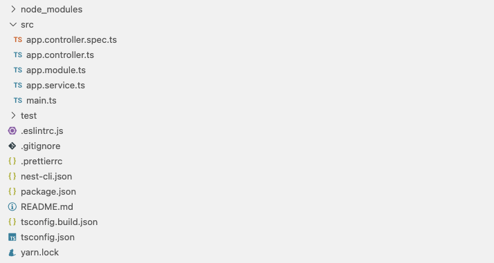

# NestJS 入門

**1. 導入・基礎編**

---

<!-- _class: lead -->

# NestJS とは?

---

<!-- _class: lead -->
## Node.js サーバーサイドフレームワークです

[公式ドキュメント](https://docs.nestjs.com/)

---

<!-- _class: small -->

## 特徴として、

- DI 機能を標準で提供している
- 便利なデコレーターがたくさんある
  - 宣言的にコードを書ける
- 拡張性が高い
- デフォルトでTypeScriptをサポート

など、

---

本スライドでは第 1 回目の導入・基礎編として Nest CLI (NestJS の CLI)経由で作成されるボイラープレートを見ながら、その構成や基本的な諸概念を簡単に説明してみます

---

<!-- _class: lead -->

## Nest CLI でプロジェクトを初期化します

[公式ドキュメント](https://docs.nestjs.com/first-steps)

---

#### NestJS の最も基本的なボイラープレートが作成されます

```
$ nest new project
```



---

#### 先にちょっと動作確認してみます

アプリケーションを実行

```
$ yarn start:dev
```

リクエスト

```
$ curl 'localhost:3000'

Hello World!
```

レスポンス('Hello World!')が返ってきます
初期状態の挙動としてはこんな感じです

---

## 実際のソースを見てみます

テストはいったん置いといて src の中身を順番に見てみます

```
src
├── app.controller.ts  # コントローラー
├── app.module.ts      # モジュール
├── app.service.ts     # サービス
├── main.ts            # メインプログラム (アプリケーション起動時に実行される)
```

---

### サービス app.service.ts

```ts
import { Injectable } from '@nestjs/common';

@Injectable()
export class AppService {
  getHello(): string {
    return 'Hello World!';
  }
}
```

ビジネスロジック(?)を **Service** として実装しています
今回は、 「'Hello World!' という文字列が欲しい」 という要件を `getHello` メソッドを公開して実現しています

---

#### Injectable

ここで Injectable デコレーターが登場しました
これは文字通り `AppService` を実体として **注入することができる** ということを意味します (実際に注入している箇所は後で確認します)

Injectable な部品を NestJS では **Provider** と呼びます
つまり、こちらのサービスはプロバイダーの一種だということになります

なお、 Injectable はデフォルトでシングルトンのプロバイダーを生成し、その唯一のインスタンスがアプリケーション全体で共有されます
([その他のスコープやスコープの指定方法など、色々あります](https://docs.nestjs.com/fundamentals/injection-scopes#provider-scope))

---

### コントローラー app.controller.ts

<!-- _class: small -->

``` ts
import { Controller, Get } from '@nestjs/common';
import { AppService } from './app.service';

@Controller()
export class AppController {
  constructor(private readonly appService: AppService) {}

  @Get()
  getHello(): string {
    return this.appService.getHello();
  }
}
```

リクエストの処理とレスポンスの返却をコントローラーで行います
今回はシンプルなRESTのコントローラーが定義されています

---

#### ルーティングとHTTPメソッド

<!-- _class: small -->

NestJS ではルーティングの定義はコントローラーに直接記述します
先ほどの、 `AppController` の場合、ルートのエンドポイント(`/`)に対してGetのリクエストをすると `getHello` メソッドが実行されます
例えば以下のように修正すると、先ほどの `getHello` メソッドのルートは `/app/hello` になります

``` ts
@Controller('app') // パスプレフィックス的な感じでパスのグルーピングなどが可能
export class AppController {
  @Get('hello') // /app/hello
  getHello(): ...

  @Post() // /app
  createHello(@Body() body: RequestBody): ...
}
```

---

#### クエリー、パスパラメーター、ボディー など、、、

<!-- _class: so-small -->


``` ts
export class AppController {
  // /?version=2 にリクエストすると version = 2 が入ってくる
  @Get()
  query(@Query('version') version?: string): ...

  // /1/2 にリクエストすると param = { id: '1', version: '2' } が入ってくる
  @Get(':id/:version')
  param(@Param() param: { id: string; version: string }): ...

  /***
   * /1 に body: { name: 'new name' } で put すると
   * id = 1, name = 'new name' が入ってくる
   */
  @Put(':id')
  put(@Param('id') id: string, @Body('name') name: string): ...
}
```

([コントローラーで使われる便利なデコレーターなど、他にも色々あります](https://docs.nestjs.com/fundamentals/injection-scopes#provider-scope))

---

### モジュール app.module.ts

```ts
import { Module } from '@nestjs/common';
import { AppController } from './app.controller';
import { AppService } from './app.service';

@Module({
  imports: [],
  controllers: [AppController],
  providers: [AppService],
})
export class AppModule {}
```

コントローラーの登録、依存性の解決、プロバイダーのカプセル化などを **Module** として実装しています

---

#### プロバイダーのカプセル化?

<!-- _class: small -->

(そもそもちょっと日本語間違ってるかもしれませんすみません)


NestJS ではモジュールを複数定義することができます

---

<!-- _class: so-small -->

もう少し具体的に見ると、、、
以下のようにモジュールがモジュールを import することができます

``` ts
@Module({
  controllers: [CatsController],
  providers: [CatsService],
})
export class CatsModule {}
```

``` ts
@Module({
  imports: [CatsModule], // ←
  controllers: [AppController],
  providers: [AppService],
})
export class AppModule {}
```

上記パターンの場合、例えば `AppController` は `CatsService` のインスタンスを従来の注入方法では参照できなくなります

---

<!-- _class: so-small -->

つまりこれはできません

``` ts
@Controller()
export class AppController {
  constructor(private readonly catsService: CatsService) {}
}
```

関連する機能やドメインをモジュール単位で整理し、明確な境界を持たせることで SOLIDの原則に従って開発するのに役立てるというのが NestJS のモジュールの思想になります
ただし、もしこれがしたい場合は、

``` ts
@Module({
  providers: [CatsService],
  exports: [CatsService] // ←
})
export class CatsModule {}
```

exports に公開するプロバイダーを宣言することで可能になります

---

### メインプログラム main.ts

``` ts
import { NestFactory } from '@nestjs/core';
import { AppModule } from './app.module';

async function bootstrap() {
  const app = await NestFactory.create(AppModule);
  await app.listen(3000);
}
bootstrap();
```

NestFactory クラスを使用して `AppModule` からアプリケーションインスタンスを作成し、HTTPリスナーを起動しています

---

##### ざっと諸機能を確認できたので改めて src の初期状態を復習してみます

```
src
├── app.controller.ts  # コントローラー
├── app.module.ts      # モジュール
├── app.service.ts     # サービス
├── main.ts            # メインプログラム (アプリケーション起動時に実行される)
```

---

### サービス app.service.ts

```ts
import { Injectable } from '@nestjs/common';

@Injectable()
export class AppService {
  getHello(): string {
    return 'Hello World!';
  }
}
```

---

### コントローラー app.controller.ts

``` ts
import { Controller, Get } from '@nestjs/common';
import { AppService } from './app.service';

@Controller()
export class AppController {
  constructor(private readonly appService: AppService) {}

  @Get()
  getHello(): string {
    return this.appService.getHello();
  }
}
```

---

### モジュール app.module.ts

```ts
import { Module } from '@nestjs/common';
import { AppController } from './app.controller';
import { AppService } from './app.service';

@Module({
  imports: [],
  controllers: [AppController],
  providers: [AppService],
})
export class AppModule {}
```

---

### メインプログラム main.ts

``` ts
import { NestFactory } from '@nestjs/core';
import { AppModule } from './app.module';

async function bootstrap() {
  const app = await NestFactory.create(AppModule);
  await app.listen(3000);
}
bootstrap();
```

---

これだけで、各リソースの管理(シングルトンで持つとか)、依存性の解決、アプリケーションの起動などなどを良い感じにこなしてくれます

<br />
<br />
<br />

、、、
とはいえ、これだけだとちょっとDIの良さなどが分からなすぎるので少しだけいじってみます
サンプルのソースは[こちら](https://github.com/minericefield/nestjs-benkyokai-slides/tree/master/1-basics/project)

---

#### 要件

<!-- _class: so-small -->

- 任意の文字列を保存したい
- 保存した文字列のリストを取得したい
- (文字列の保存方法はいわゆる非機能要件で開発側でまだ詰めれてない)

要件が分かりづらくて申し訳ないですが、RESTだとこんな感じのことがしたい、みたいなイメージです

```
1. 'テキスト1' を post する
2. 'テキスト2' を post する
3. get すると ['テキスト1', 'テキスト2'] が返される
```

※
ドメインオブジェクト、module、 などは作成しません
DI の動きを確認するために文字列を保存するストレージの実装をするだけです
ファイルもフラットに雑に並べるだけです

---
##### 文字列ストレージ要件を表現する

``` ts
export abstract class TextsStorage {
  abstract find(): Promise<string[]>;
  abstract create(text: string): Promise<void>;
}
```

要件は保存と取得です
それぞれの定義を抽象クラスで純粋に表現しました

---

##### 保存方法が決まってないので一旦インメモリーのストレージで実装してみる

``` ts
import { Injectable } from '@nestjs/common';
import { TextsStorage } from './texts-storage';

@Injectable()
export class TextsStorageInMemory implements TextsStorage {
  private texts: string[] = [];

  async find() {
    return this.texts;
  }

  async create(text: string) {
    this.texts = [...this.texts, text];
  }
}
```

---

##### 組み込んでいきます まずはサービスから

``` ts
import { Injectable } from '@nestjs/common';
import { TextsStorage } from './texts-storage';

@Injectable()
export class AppService {
  constructor(private readonly textsStorage: TextsStorage) {}

  async createText(text: string) {
    await this.textsStorage.create(text);
  }

  async findTexts() {
    return this.textsStorage.find();
  }
}
```

---
##### コントローラー

<!-- _class: so-small -->

``` ts
import { Body, Controller, Get, Post } from '@nestjs/common';
import { AppService } from './app.service';

@Controller()
export class AppController {
  constructor(private readonly appService: AppService) {}

  @Post('texts')
  async createText(@Body('text') text: string) {
    await this.appService.createText(text);
  }

  @Get('texts')
  async findTexts() {
    const texts = await this.appService.findTexts();
    return texts; // 特に整形とかしてないです
  }
}
```

---

##### モジュール (ここがDIしているところです)

<!-- _class: so-small -->

``` ts
import { Module } from '@nestjs/common';
import { AppController } from './app.controller';
import { AppService } from './app.service';
import { TextsStorage } from './texts-storage';
import { TextsStorageInMemory } from './texts-storage.in-memory';

@Module({
  controllers: [AppController],
  providers: [
    AppService,
    {
      provide: TextsStorage, // TextsStorage を使用する際は、
      useClass: TextsStorageInMemory, // 実体としては InMemory の Storage が使われる
    },
  ],
})
export class AppModule {}
```

---

ここまでで、インメモリーのストレージで要件を満たすことができましたが

、、、

時間が経ち、開発側で
- ストレージはjsonファイル
- ライブラリは [fs-extra](https://github.com/jprichardson/node-fs-extra) というものを採用する

ことが決まりました
実装していきます

---

##### jsonファイル、fs-extraを用いた実装

<!-- _class: so-small -->

``` ts
import { readJSON, writeJSON } from 'fs-extra';
import { Injectable } from '@nestjs/common';
import { TextsStorage } from './texts-storage';
import { resolve } from 'path';

@Injectable()
export class TextsStorageJsonFsExtra implements TextsStorage {
  private readonly STORAGE_PATH = resolve(__dirname, 'texts-json-storage.json');

  async find() {
    return readJSON(this.STORAGE_PATH);
  }

  async create(text: string) {
    const currentTexts = await readJSON(this.STORAGE_PATH);
    await writeJSON(this.STORAGE_PATH, [...currentTexts, text]);
  }
}
```

---

##### DIしてるところを直します

``` ts
import { Module } from '@nestjs/common';
import { AppController } from './app.controller';
import { AppService } from './app.service';
import { TextsStorage } from './texts-storage';
import { TextsStorageJsonFsExtra } from './texts-storage.json-fs-extra';

@Module({
  imports: [],
  controllers: [AppController],
  providers: [
    AppService,
    {
      provide: TextsStorage,
      useClass: TextsStorageJsonFsExtra, // json, fs-extra にした 実際は環境変数とかコンフィグを用いて制御することが多い
    },
  ],
})
export class AppModule {}
```

---

これで完成です

DIを利用して

- 確定していない非機能要件に先行して実装を進めることができた
- ストレージが確定した際に変更を加えた箇所はDIの部分のみ
- インメモリーストレージはテストの時など、場合に応じて継続して使用することができる可能性がある
- (依存性の逆転)

などなどを実現することができました

---

<!-- _class: lead -->

# ありがとうございました

---

<!-- _class: lead -->
# おまけ(もし時間が余っちゃったら)

---

<!-- _class: lead -->

# Service とは?

※ 個人的な解釈に過ぎないのでご意見いただけるとありがたいです

---

<!-- _class: small -->

ここまで説明したボイラープレートの初期状態を振り返ってみると

- controller → RESTのエンドポイントの定義をしていた → どういうものなのかなんとなく分かる
- module → 依存性の解決を含むアプリケーションの定義をしていた → なんとなく分かる
- **service → getHello していた、Injectable だった → つまり???**

controller, module についてはなんとなくその責務・役割のイメージが湧きますが、一方で service については結局これがどういったものなのか、、少し分かりづらい気がしました
(もちろん controller, module についてもより深い洞察があっても良いかもですが)

---

##### しかしそもそも Service とは? というテーマに意味はあるのか

<!-- _class: small -->

- プログラムは全体として、機能要件・非機能要件の両方を含む複雑なもの
- 例えばこれらを無秩序にごちゃまぜにしてしまうと、実装(、修正)が困難になる
  - 機能要件、非機能要件はそれぞれどこにあるのか? どこに実装すべきか
  - どの部分が他のどこに影響を与えるのか?

などなど、、、

ある程度の原則を共通認識として持っていないとソースの維持コストが増加してしまうかもしれません
特に Service という言葉は意味が広く抽象的なので無秩序な状況を生みやすそう

---

##### NestJS 公式の見解

<!-- _class: so-small -->

調べてみたのですが、はっきりとした Service の定義は見つけられませんでした

> [Controllers should handle HTTP requests and delegate more complex tasks to providers. ](https://docs.nestjs.com/providers)

- コントローラーはより複雑なタスクをプロバイダーに委譲すると言っている
- 実際にコントローラーはサービスに依存しそのようなことをサンプルコードでもやっているが、サービスやその他プロバイダーが常にこのようなものだとは言っていない
  - [LoggerService](https://docs.nestjs.com/techniques/logger#custom-implementation), [ConfigService](https://docs.nestjs.com/techniques/configuration#using-the-configservice) など、コントローラー以外からも使われるようなプロバイダーにもサービスという命名が使用されている など

なので、、

---

##### 自分たちで何かしらの原則を導入するのが良いかもしれません

<!-- _class: small -->

例えばDDDだと、

サービスレイヤー = アプリケーションレイヤー になります

> Presentation layer = user interface layer
**Service layer = application layer**
Business logic layer = domain layer = model layer 
Data access layer = infrastructure layer

引用: [Learning Domain-Driven Design: Aligning Software Architecture and Business Strategy](https://www.amazon.co.jp/Learning-Domain-driven-Design-Aligning-Architecture/dp/1098100131)

###### 「Service = 機能要件を満たす純粋なシナリオ」
みたいな原則を自分たちで導入するのはありだと思います

---

##### つまり、 Service とは

- 公式の見解もはっきりとは分からなかった (見落としてるところがあったらすみません)
- 自分たちで一定の原則を定義するのも良さそう
- DDD だと サービス層 = アプリケーション層

---

<!-- _class: lead -->

# ありがとうございました
